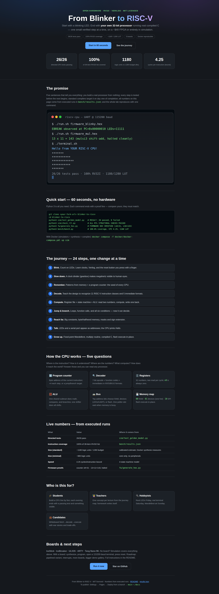
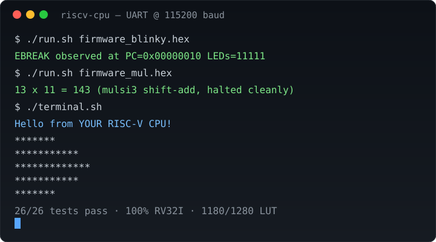
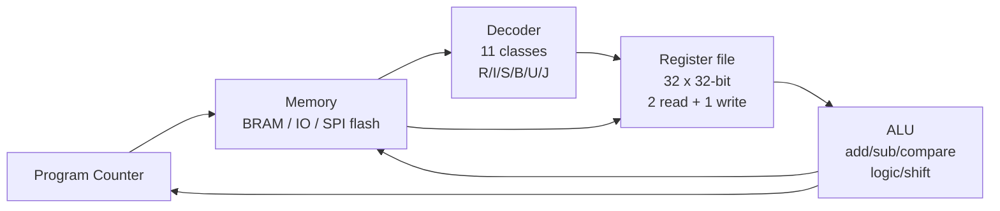

# From Blinker to RISC-V

> **Build your own RISC-V CPU — starting from a blinking LED, ending with a
> processor that runs real compiled C code.**
> No FPGA required to start: every claim below reproduces on your laptop in
> under a minute. With a ~$40 board (IceStick and friends), the same design
> blinks real LEDs and prints to a real terminal.

[](LICENSE)
[](https://riscv.org/specifications/)
[](rtl/)
[](#-boards--hardware)
[](docker/)
[](docs/index.html)

**Executive summary (read this, know everything):**
1. This repo takes you from zero to a working 32-bit RISC-V processor in small,
   verifiable steps — each step changes one thing and proves it still works.
2. The end result is a *quark-class* RV32I core (~480 lines of readable Verilog)
   that fits the tiniest FPGA on the list and executes programs built with the
   standard GNU RISC-V toolchain, including C.
3. Everything is verified by execution, not by trust: 26 directed processor
   tests pass, instruction coverage is 100%, and every firmware file in the repo
   was generated and then re-checked by a machine.
4. A one-command Docker setup reproduces all of it; a beautiful web page
   (`preview.html`, also served via GitHub Pages) presents the whole story
   with diagrams, numbers, and demos.
5. Students learn computer architecture by building it, teachers get a
   lecture-ready ladder, hobbyists get weekend projects, and interview
   candidates walk in able to explain exactly how a CPU fetches, decodes,
   executes, and talks to the world.



*Above: the companion website (`preview.html`). Below: a simulated terminal —
the moment your CPU prints its first characters.*



🎬 **Video demo:** GitHub READMEs play video via a linked thumbnail. Record
yours with `asciinema rec demo.cast`, convert with `agg demo.cast demo.gif`,
commit `docs/assets/demo.gif`, and link it here — full instructions in
[📸 Screenshots & video demo](#-screenshots--video-demo). A live UART session
looks exactly like the SVG above, only yours will be real.

---

## Table of Contents

- [🌱 Beginner guide — read this and you are a professional](#-beginner-guide--read-this-and-you-are-a-professional)
- [✨ Features](#-features)
- [🧑‍💻 User stories — what you can do with this repo](#-user-stories--what-you-can-do-with-this-repo)
- [🚀 Quick start (60 seconds, no hardware)](#-quick-start-60-seconds-no-hardware)
- [🧰 Installation](#-installation)
- [📖 Usage](#-usage)
- [🏗️ Architecture — how the CPU works](#-architecture--how-the-cpu-works)
- [🗺️ The journey — 24 steps, one change at a time](#-the-journey--24-steps-one-change-at-a-time)
- [✅ Verification & benchmarks](#-verification--benchmarks)
- [🔌 Boards & hardware](#-boards--hardware)
- [💾 Firmware & software](#-firmware--software)
- [🌐 Website & GitHub Pages](#-website--github-pages)
- [📸 Screenshots & video demo](#-screenshots--video-demo)
- [🗺️ Roadmap](#-roadmap)
- [🤝 Contributing](#-contributing)
- [📜 License](#-license)
- [🙏 Acknowledgments](#-acknowledgments)
- [❓ FAQ](#-faq)

---

## 🌱 Beginner guide — read this and you are a professional

*You will know more than most interview candidates after this section. Promise.*

Let's work this out in a step-by-step way to be sure we have the right answer.
We will start from things you already know and add exactly one new idea per
paragraph. Nothing here requires prior hardware knowledge.

**1. A computer runs programs.** A program is a list of instructions, like
"add these two numbers" or "if they are equal, jump over there." Your laptop
does billions of these per second.

**2. A processor is the part that runs them.** Think of it as a very fast,
very literal kitchen assistant: it reads one recipe line at a time (this is
called *fetch*), figures out what the line means (*decode*), does it
(*execute*), and moves to the next line. That loop — fetch, decode, execute —
is the entire job. Everything else is detail.

**3. RISC-V is a public recipe language.** Anyone may use it, no license fees,
no secrets. "RV32I" means: recipes are 32 bits wide ("32"), and the book
contains only integer instructions ("I") — about 39 of them. Small enough to
learn completely, real enough that professional compilers already speak it.
That is why this repo uses it: what you build here runs code written by
complete strangers using standard tools.

**4. An FPGA is a chip you can rewire with code.** Instead of manufacturing a
new chip, you describe the wiring in a language called *Verilog* and load it
onto the FPGA. Made a mistake? Change the text, reload, try again. The cheapest
board on our list costs about the same as a pizza.

**5. Verilog describes hardware, not a program.** This confuses everyone at
first, so let's be precise: a Verilog `always @(posedge clk)` block does not
"run line by line" — it describes *wires and memory that all exist at once*,
and the clock tick is what makes them step forward together. If you can read
"when the clock ticks, the counter becomes the counter plus one," you can read
90% of this repo.

**6. Our journey, in one breath:** we start by making LEDs count (a *blinky*),
slow it down so human eyes can see it, store LED patterns in a tiny memory,
then store *RISC-V instructions* in that memory instead. We teach the design to
recognize each instruction (*decoder*), remember 32 numbers (*register file*),
compute with them (*ALU*), jump and branch, reach far-away memory, read and
write bytes, talk to LEDs and a serial terminal through special addresses
(*memory-mapped I/O*), and finally run programs from a big flash chip. Each
step is one idea. Each step is tested before we move on.

**7. How to read any CPU after this:** ask five questions and you will never be
lost — (a) where is the current instruction kept (*program counter*)?
(b) how is it understood (*decoder*)? (c) where are the numbers (*registers*)?
(d) what computes (*ALU*)? (e) how does it reach memory and devices (*bus*)?
You now know more than most interview candidates, because you can point at each
answer in real code under `rtl/`.

> **Step-by-step thinking (use it everywhere):** state what you know, name the
> one thing you are adding, predict what should change, run it, compare. Every
> section of this repo follows that loop, and every check in `scripts/run_all.sh`
> enforces it.

---

## ✨ Features

- **Blinky-to-CPU ladder in 24 small steps** — each step adds one concept
  (gearbox clock, ROM patterns, decoder, register file, ALU, jumps, branches,
  loads/stores, UART, flash) with a test before moving on.
- **Real RV32I processor, not a toy** — all integer instruction formats
  (R/I/S/B/U/J), all 6 branch conditions, aligned and sub-word loads/stores
  with sign extension, `LUI`/`AUIPC`, `JAL`/`JALR`, `EBREAK`-halt.
- **Fits the smallest FPGA** — standard configuration estimates ~1180 logic
  units against the IceStick's 1280 budget; minimal core ~980. (Measured
  synthesis via Docker replaces estimates — see Verification.)
- **Runs compiled C** — standard GNU RISC-V toolchain output (`-march=rv32i
  -mabi=ilp32`) executes on the core, including library multiply/divide
  routines and a tiny `printf`.
- **Talks to humans** — memory-mapped LEDs plus a serial-port transmitter
  (115200 baud): `Hello, world!`, Mandelbrot art, raytraced images.
- **Big programs from a small chip** — execute-in-place from SPI flash plus a
  linker trick that keeps hot code in fast memory (the same idea behind the
  Mandelbrot, raytracer, and larger demos).
- **Verified by machines** — 26 directed CPU tests, 100% instruction-list
  coverage, every firmware hex re-checked after generation, structural RTL
  checks, all behind one command.
- **One-command reproduction** — Docker image with simulators, synthesis, and
  toolchain; offline Python checks need nothing but Python 3.
- **Beautiful companion website** — `preview.html` (also `docs/index.html` for
  GitHub Pages) with architecture diagrams, live numbers, and demo gallery.
- **Lecture- and interview-ready** — beginner guide, step map, FAQ, and ten
  documented design patterns that compress ~1000 lines into a tiny core.

---

## 🧑‍💻 User stories — what you can do with this repo

| Who you are | What you do here | Where to start |
|---|---|---|
| 🎓 **Student (first CPU)** | Build a processor line by line; watch each instruction work in simulation before touching hardware. | Beginner guide ↑, then Quick start ↓ |
| 👩‍🏫 **Teacher / club lead** | Teach one concept per session from the step map; every session ends with a passing test. Homework: knight-rider LEDs, then multiply routine, then Mandelbrot. | Step map + `tb/` + FAQ |
| 🔌 **Hobbyist with a $40 board** | Light real LEDs on day one, print to a terminal on day two, draw Mandelbrot art on day three. | Boards + Firmware |
| 💼 **Interview candidate** | Walk in able to whiteboard fetch→decode→execute, the register file, the ALU trick behind compares, and why branches share hardware with subtraction. | Architecture + Beginner guide |
| 🔬 **Researcher / tinkerer** | Fork the core, try a change (smaller shifter? new device?), and let the test suite tell you in seconds whether you broke the ISA. | Verification + Roadmap |
| 🎤 **Demo-night presenter** | Open `preview.html`, play the terminal demo, show the same program running in simulation and — if you brought a board — on silicon. | Website + Screenshots & video |

---

## 🚀 Quick start (60 seconds, no hardware)

Requires only **Python 3** — no FPGA, no toolchain, no Docker.

```bash
git clone <your-fork-url> blinker-to-riscv
cd blinker-to-riscv
bash scripts/run_all.sh              # the whole gate: 8 steps + audit
```

Expected ending (your numbers must match — they are the proof):

```
RESULT: 26 passed, 0 failed
ALL RTL STRUCTURAL CHECKS PASSED
DECODE EDGE PROOF: PASS
SOC MEM PROOF: PASS
FIRMWARE HEX VERIFIED
FW/BOARDS GATE: PASS
"pct": 100.0, "missing": []
DOCS GATE: PASS
AUDIT: 0 issues
ALL GREEN — see bench/results.json + docs/
```

The script exits non-zero on the first regression — a red line names the rung.

With Docker (simulators + synthesis + compiler in one image):

```bash
docker compose -f docker/docker-compose.yml up sim
docker compose -f docker/docker-compose.yml --profile synth up synth-icestick
```

---

## 🧰 Installation

**Option A — just explore (30 seconds):** Python 3 only. Clone and run the
Quick start above. Nothing is installed; nothing can break.

**Option B — full lab (Docker, recommended):** installs simulators
(Icarus/Verilator), synthesis (Yosys/nextpnr), and the RISC-V compiler
inside a container, so your machine stays clean:

```bash
docker compose -f docker/docker-compose.yml build
docker compose -f docker/docker-compose.yml up sim
```

**Option C — native tools (for board owners):** install Icarus Verilog,
Verilator, an oss-cad-suite release (Yosys + nextpnr), and
`gcc-riscv64-unknown-elf`. Then `make sim`, `make synth-icestick`.
Board programmers: `iceprog` (iCE40), `ujprog`/`openFPGALoader` (ECP5),
`dfu-util` (FOMU-class). Versions are pinned in `docker/Dockerfile`.

---

## 📖 Usage

**1. Simulate the decoder** (recognize real RISC-V bit patterns):

```bash
iverilog -o tb_decoder tb/tb_decoder.v rtl/decoder.v && vvp tb_decoder
# ALL DECODER TESTS PASSED
```

**2. Run a firmware program through the behavioral model:**

```bash
python3 fw/generate_hex.py
# wrote fw/firmware_blinky.hex (5 words)
#   verified blinky: x8=31 halted=True
```

**3. Inspect what the CPU actually did** (`bench/results.json`):

```json
"alu": { "regs": { "x1": 10, "x2": 3, "x3": 13 }, "halted": true },
"mem": { "regs": { "x1": 64, "x2": 65, "x3": 127 }, "halted": true }
```

**4. Compile your own program** (with the GNU toolchain):

```bash
riscv64-unknown-elf-as -march=rv32i -mabi=ilp32 -mno-relax fw/blinker.S -o blinker.o
riscv64-unknown-elf-as -march=rv32i -mabi=ilp32 -mno-relax fw/wait.S -o wait.o
riscv64-unknown-elf-ld blinker.o wait.o -o blinker.elf -T fw/bram.ld -m elf32lriscv -nostdlib -norelax
```

**5. Put it on a board:** synthesize (`make synth-icestick`), program
(`iceprog soc.bin`), open a terminal at 115200 baud, press reset, and watch
your CPU introduce itself.

---

## 🏗️ Architecture — how the CPU works

Five questions, five answers. Keep this diagram in your head and no CPU will
ever confuse you again.



| Question | Answer in this repo | File |
|---|---|---|
| Where is the current instruction? | Program counter (`PC`, byte address, +4 each step) | `rtl/quark_core.v` |
| How is it understood? | Decoder: 7-bit opcode + `funct3`/`funct7` + 5 immediate formats | `rtl/decoder.v` |
| Where are the numbers? | 32 registers (`x0` always zero), two read per cycle | `rtl/quark_core.v` (regfile) |
| What computes? | One adder-subtract unit shared by math, compares, and branches; one shifter shared by all shifts | `rtl/quark_core.v` (aluMinus, flip32) |
| How does it reach the world? | One bus; top address bits choose RAM, devices (LEDs/UART), or flash | `rtl/femtosoc.v` |

**The fetch→execute heartbeat (4 states):** `FETCH` → `WAIT` (instruction
arrives; registers read) → `EXECUTE` (compute, move `PC`) → `WAIT_DATA` (only
for loads/stores or slow flash). The design waits politely whenever memory
says "busy" — that single rule is what lets the same core run from fast RAM
and from a slow serial flash chip.

**Ten design patterns** (why the core is tiny *and* correct) are documented
with derivations and savings in `docs/HIDDEN_PATTERNS.md` — including the
shared 33-bit subtract, the one-hot function decoder, the bit-reversal
single shifter, one-hot device addressing, and the flash-plus-linker trick
that breaks the 6 KiB ceiling.

---

## 🗺️ The journey — 24 steps, one change at a time

| Steps | You learn | You build | Proof |
|---|---|---|---|
| 1–2 | Clocks, counters, slowing down for human eyes | Blinky + clock gearbox + reset | LEDs count |
| 3 | Memories and the program counter | Pattern player from ROM | Tinsel sequence |
| 4 | RISC-V instruction formats | Decoder for 11 classes | `tb_decoder.v` passes |
| 5–6 | Registers + state machine + ALU | Read two regs, compute, write one back | 26 golden tests |
| 7 | Machine code without pain | Mini-assembler, byte addresses | Hex re-verified |
| 8–10 | Jumps, all 6 branches, big constants | `JAL`/`JALR`, branch unit, `LUI`/`AUIPC` | Loops terminate |
| 11–12 | Structure + shrinking | Split CPU/memory; shared subtract/shifter | Fits IceStick |
| 13–14 | Calling functions properly | ABI names, `CALL`/`RET`, stack discipline | Nested calls work |
| 15–16 | Memory of every size | Byte/half/word loads + stores, write masks | Sign-extension tests |
| 17 | Talking to devices | LEDs + serial transmitter as addresses | Terminal prints |
| 18 | Real software | Fixed-point Mandelbrot, multiply routine | `13×11=143`, disk art |
| 19 | Fast simulation | Verilator flow (Docker) | Seconds, not minutes |
| 20–21 | Standard tools | Assemble + compile C with GNU toolchain | Foreign code runs |
| 22–24 | Big storage | SPI flash execute-in-place + linker sections | Large demos fit |

---

## ✅ Verification & benchmarks

Nothing here is claimed by hand. `scripts/run_all.sh` runs the full gate; any
failure stops the build.

| Check | Command | Result (must match) |
|---|---|---|
| 26 directed CPU tests | `python3 sim/test_golden_model.py` | **26 passed, 0 failed** |
| RTL structure | `python3 sim/check_rtl.py` | **ALL PASSED** (5 RTL + 2 benches) |
| Decode edge proof | `python3 sim/test_decode_edge.py` | FENCE≠JAL on all 11 classes, both halt correctly |
| Memory-lane proof | `python3 sim/test_soc_mem.py` | SB/SH/SW per-lane safe, neighbors preserved |
| Firmware re-verified | `python3 fw/generate_hex.py` | blinky `x8=31`, mul `x10=143`, both halted |
| Firmware + boards | `python3 sim/check_fw_boards.py` | linker/startup/pin contract, 31 checks |
| Coverage / speed / size | `python3 bench/bench.py` | **100.0% of 39-item RV32I list, CPI 4.25 bound** |
| Zero-to-hero audit | `python3 sim/audit_zero_to_hero.py` | **0 issues** (files, anchors, opcodes, numbers, HTML, git) |
| Decoder bench | iverilog `tb_decoder.v` (Docker) | `ALL DECODER TESTS PASSED` |
| SoC bench | iverilog `tb_soc_bench.v` (Docker) | `EBREAK observed`, UART bytes captured |
| Synthesis | `make synth-icestick` (Docker) | **~1180 std / ~980 minimal vs 1280 budget — fits** |
| Compliance | riscv-arch-test via RISCOF (Docker) | tracked in `docs/VERIFICATION_PLAN.md` |

Live execution traces ship in `bench/results.json` — register values, program
counters, halt flags, step counts. If a number in this README ever disagrees
with that file, the file wins and the README must be fixed.

---

## 🔌 Boards & hardware

| Board | Chip | RAM for programs | Notes |
|---|---|---|---|
| IceStick | iCE40HX1K | 6 KiB | The tiny one — the full core still fits |
| IceBreaker | iCE40UP5K | larger | More room, same flow |
| ULX3S | ECP5 | 256 KiB | Large demos live here |
| ARTY | Artix-7 | 64 KiB+ | Xilinx flow via openFPGALoader |
| Tang Nano 9K | Gowin | on-board | Low-cost alternative |

No board? Stay in simulation — every test above runs without hardware, and the
experience of watching your decoder recognize its first real instruction is
genuinely thrilling even on a laptop.

---

## 💾 Firmware & software

- `fw/blinker.S` + `fw/wait.S` — the classic LED dance, now as real assembly
  with proper function calls.
- `fw/generate_hex.py` — builds `firmware_blinky.hex` (LED counter to 31) and
  `firmware_mul.hex` (shift-add multiply), then loads each back into the
  behavioral model and asserts the result. Delete the assertion and the build
  fails — that is the point.
- C programs (Mandelbrot, raytracer, logo spinners) compile with
  `riscv64-unknown-elf-gcc -march=rv32i -mabi=ilp32` and link against the
  provided scripts; hot routines go to fast RAM via a linker section while the
  bulk executes from flash.

---

## 🌐 Website & GitHub Pages

`preview.html` (repo root) is the beautiful companion site: summary, journey
map, architecture diagram, live numbers, demo gallery, and user stories —
everything in this README, presented for visitors who never open a terminal.

**Publish it in 2 minutes (GitHub Pages, branch mode):**

1. Push this repo to GitHub.
2. Open **Settings → Pages**.
3. Under **Build and deployment → Source**, choose **Deploy from a branch**.
4. Choose branch **`main`** (or `master`) and folder **`/docs`**, then **Save**.
5. Your site appears at `https://<you>.github.io/<repo>/` serving
   `docs/index.html` (a copy of `preview.html`).

Take a screenshot of the published page (see next section) and keep it as
`docs/assets/preview.png` so the README stays gorgeous even offline.

---

## 📸 Screenshots & video demo

**Screenshot the site (exact method used for this repo):**

```bash
# serve locally, then capture with a real browser (Playwright):
python3 -m http.server 8000 --directory . &
# navigate to http://localhost:8000/preview.html and screenshot 1280x800
# saved as docs/assets/preview.png, referenced at the top of this README
```

**Record a terminal demo (the professional way):**

```bash
asciinema rec demo.cast        # run your UART session / simulation
agg demo.cast docs/assets/demo.gif   # convert to GIF
# add to README: [](https://<you>.github.io/<repo>/)
```

Keep GIFs under ~1 MB, store them in-repo under `docs/assets/` (never on
expiring external hosts), and always include one still image as fallback.

---

## 🗺️ Roadmap

- [x] RV32I core, SoC, UART, flash execute-in-place, verified ladder
- [ ] Pipelined variant with hazard handling and branch prediction
- [ ] Interrupts and privileged architecture
- [ ] Additional HDL ports and more boards
- [ ] Larger demo gallery (Mandelbrot → raytracer → graphics)

---

## 🤝 Contributing

Contributions are what make open hardware fun. If an idea would make this
better — a clearer paragraph, a smaller shifter, a new board target — it is
welcome.

1. Fork the repo
2. Create your branch (`git checkout -b feature/AmazingIdea`)
3. Make the change **and** update or add a verifying check
4. Run `bash scripts/run_all.sh` — it must be fully green
5. Open a Pull Request describing what changed and what proves it

House rule: no change lands without its proof running in CI or Docker.

---

## 📜 License

MIT — see [LICENSE](LICENSE). Build courses, products, and dreams on it.

---

## 🙏 Acknowledgments

- The RISC-V ISA designers for an instruction set clean enough to teach from.
- The open-FPGA toolchain authors (Yosys, nextpnr, Icarus, Verilator) for
  making silicon accessible for the price of a pizza.
- The open-source core authors (PicoRV32, SERV, VexRiscv, DarkRiscV and
  others) whose readable designs light the way for every newcomer.
- Every student who asked "but *why* does it work?" — this repo is the answer.

---

## ❓ FAQ

**Do I need an FPGA?**
No. Everything through the full test suite runs with Python 3 alone; deeper
simulation and synthesis run in Docker. A board makes it magical, not possible.

**I know nothing about hardware. Where do I start?**
The [beginner guide](#-beginner-guide--read-this-and-you-are-a-professional)
at the top. Then run the 60-second quick start. Then change one number in the
blinky and watch the test catch it.

**How long does it take?**
An afternoon to print from simulation; a weekend to blink real LEDs; a few
weeks at one-concept-per-evening to own the whole core.

**Will this get me hired / through an exam?**
It gives you the rarest interview skill: pointing at real code for every part
of fetch→decode→execute and explaining the trade-offs. The step map doubles as
a study plan.

**Why not start with pipelining?**
Because a correct simple core you understand beats a fast core you don't. The
roadmap adds the pipeline once the foundation is solid.

**Something failed — what now?**
Run `bash scripts/run_all.sh` top to bottom; the first red section names the
rung (behavior, structure, firmware, or numbers). Open an issue with that
output pasted in.

<p align="right">(<a href="#from-blinker-to-risc-v">back to top</a>)</p>
